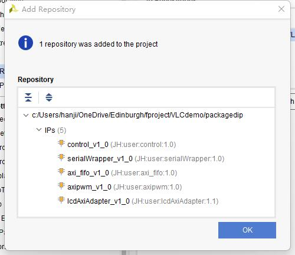
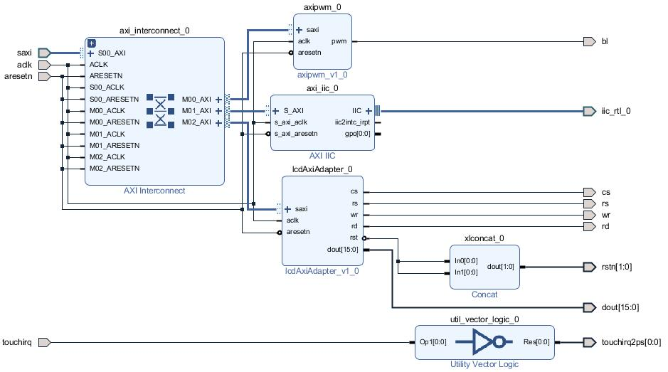
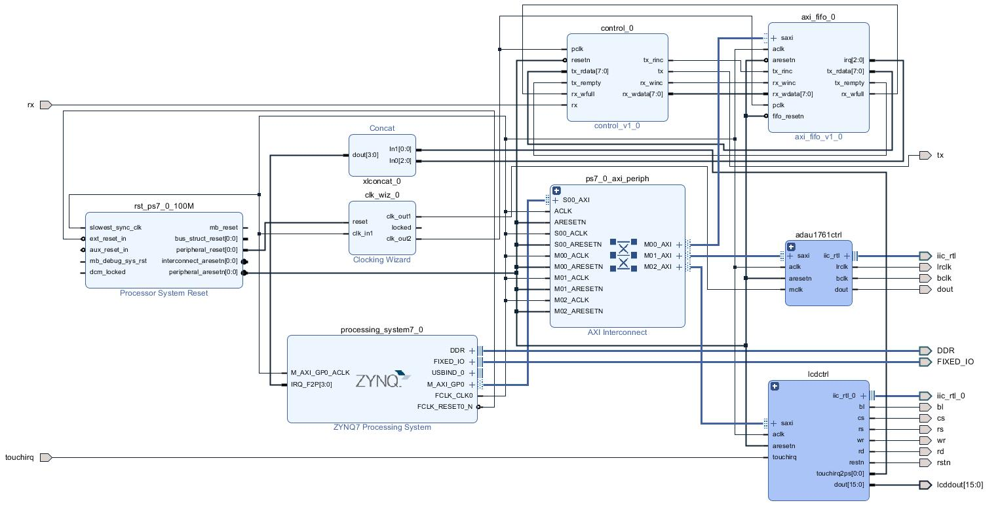
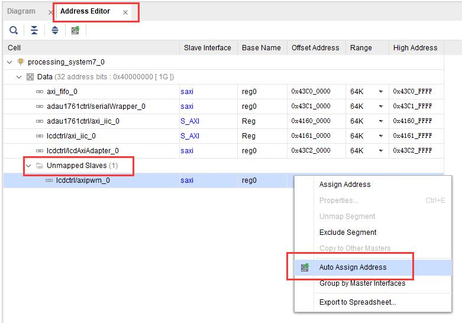

# Rebuild for Receiver

- [Rebuild for Receiver](#rebuild-for-receiver)
  - [Create A Vivado Project](#create-a-vivado-project)
  - [Add IP to Vivado IP list](#add-ip-to-vivado-ip-list)
  - [Create Block Diagram](#create-block-diagram)
    - [Core Modules](#core-modules)
    - [ADAU1761 Codec Driver Circuit](#adau1761-codec-driver-circuit)
    - [LCD and Touch Controller Driver Circuit](#lcd-and-touch-controller-driver-circuit)
    - [Interrupts](#interrupts)
    - [Assign Address for IPs with AXI interface](#assign-address-for-ips-with-axi-interface)
  - [Generate Bitstream and Export Hardware](#generate-bitstream-and-export-hardware)

## Create A Vivado Project 

Firstly, we need to create a Vivado project.  
**1)** Launch Vivado, and create a new project.  
**2)** click create a new project and select the location you want to save your project, click next. Then select RTL Project and tick the box `Do not specify sources at this time`, click next.  
**3)** Now we need to select the parts we used fo our project. In this case, we are using PYNQ-Z2 and we have installed the board file, click the `Boards` from the tool bar, and select `PYNQ-Z2` as shown below. 

  

*The Board file can be downloaded via TUL website: https://www.tulembedded.com/FPGA/ProductsPYNQ-Z2.html*   
*The Tutorial of installing board file can be found here (the step 3): https://digilent.com/reference/programmable-logic/guides/installing-vivado-and-sdk*

**4)** Then click finished. Now we should have an empty project. 

## Add IP to Vivado IP list

*In this tutorial, we will use pre-packaged IP to recreate the hardware for the receiver. If you want to package IP yourself, please see this [tutorial](./packageyoourip.md).*  

**1)** Click the `Settings` in the `PROJECT MANAGER` below the `Flow Navigator`  
**2)** Click `IP` -> `Repository`, and then click `+` as shown below   

  

**3)** Then select the directory stored the folder `packagedip` in this repository, then click `OK`. A window should pop up with all the prepackaged IPs as shown below. Then click `OK` to close the settings.  

  

## Create Block Diagram 
Once we have all the components we needed, the next job is to connected them together.  

### Core Modules 
**1)** Click `Create Block Design` under the `IP INTEGRATOR` in the `Flow Navigator`. Then give the block diagram the name you like. Then we need to click `+` to add IPs we want. 

**2)** The First IP we need is named `ZYNQ7 Processing System` (using **PS** to represent the IP in the following section). Firstly, Click `+`. Then Find IP named `ZYNQ7 Processing System` and double click it to add it to our block diagram. As we are using boards with board file, this IP can be configured automatically. 

   

Click the `Run Block Automation` and select `All Automation` at left side of the menu. Then click `OK`. 

*For more information, please see the ZYNQ mannual: https://docs.xilinx.com/v/u/en-US/ug585-Zynq-7000-TRM* 

After that, we still need to modified the IP some functions are not enbaled in the automation process. Double clock the IP `ZYNQ7 Processing System`, Click `Interrupt` in the `Page Navigator`. Then tick and expand the option `Fabric Interrupts`. Next, expand the tab `PL-PS Interrupt Ports` and tick `IRQ_F2P[15:0]` to allow the PS to respond to the interrupts from PL.   

  

**3)** Now, lets add the core module for the VLC system - the tx fifo, rx fifo, and the control unit. The fifos is packaged with the AXI interface and the control unit is packaged as an IP as well.  

Simliar, click `+`, then find and add IP `axi_fifo_v1_0` and `control_v1_0` to the block diagram.   

Next, we need to connect the fifos to the PS via the AXI interface by click the `Run Connection Automation` below the toolbar.   

  

Once finished, two extra IPs will shown at the block diagram, named `AXI interconnect` and `Processor System Reset`. They are used to generate essential signals and extend the system connectivity.   

*For more information, please see*  
*AXI Interconnect: https://docs.xilinx.com/r/en-US/pg059-axi-interconnect*  
*Processor System Reset: https://docs.xilinx.com/v/u/en-US/pg164-proc-sys-reset*   

---
Then, we can see that the IPs `axi_fifo_v1_0` and `control_v1_0` share many pins with the same name. We need to connect the pins with the same name except for the clock and resetn signals.  

Now, focus on the `control_v1_0` first, there are four pins left unconnected. Among those pins, the `rx` and `tx` are external pins. Right click at the blank area of the block diagram, then click `create port` or using shortcut `Ctrl+K`. 

We need to create one **input** `RX` and another **output** `TX`.   
   
Once completed creating **BOTH rx and tx**, connect them to the `control_v1_0` with the pin having the same name.  

Now, only the clock signals and the resetn signal from both two IPs are left unconnected. Both the two IP are designed to be driven by $16MHz$ clock while the `ZYNQ7 Processing System` output $100MHz$ clock. Therefore, we need add another IP named `Clocking Wizard`. Once added, double clock the IP. Change the parameters as shown below and leave other seeting as default.   

   
   

*Note that the $12.288MHz$ clock is for the ADAU1761 codec which will be mentioned later*  

Then, connect the the pins as shown at the below table. 
|Source|to| Destnation|
|-|-|-|
| `ZYNQ7 Processing System.FCLK_CLK0`| -> |`Clocking Wizard.clk_in1` |
| `Processor System Reset.peripheral_reset[0:0]` | -> |`Clocking Wizard.reset`|
| `Clocking Wizard.clk_out2` | -> | `control_v1_0.pclk`|
| `Clocking Wizard.clk_out2` | -> | `axi_fifo_v1_0.pclk`| 
| `Processor System Reset.peripheral_aresetn[0:0]` | -> |`control_v1_0.resetn`|
| `Processor System Reset.peripheral_aresetn[0:0]` | -> |`Clocking Wizard.fifo_resetn`|

### ADAU1761 Codec Driver Circuit
Now, lets created the circuit for the ADAU1761 Codec.  
*The connection and configuration method can be founded in below links*  
*PYNQ-Z2 Schematics: https://dpoauwgwqsy2x.cloudfront.net/Download/TUL_PYNQ_Schematic_R12.pdf*   
*ADAU Datasheet: https://www.analog.com/media/en/technical-documentation/data-sheets/ADAU1761.pdf*  

The Codec is connected to the PL and using IIC to configure. Therefore, we need an IP named `AXI IIC` to set the internal registers in the codec and another prepackage ID to transfer audio stream to the codec. 

First, right click at any blank area in the block diagram and then click `Create Hierarchy...`. Then give the subblock a name, e.g., `ADAU1761Ctrl`. Once finished, double click the deep blue subblok to enter it. 

then simliar, click `+`, then find and add IPs `AXI IIC`, `serialWrapper_v1_0`, and `AXI Interconnect` to the block diagram.   

Clock the `Run Connection Automation` at the above and select the same option as shown below. Click `OK` once finished.   

  

After that, we need create input and output pins for this sub block. Similarly, press `Ctrl+K` to create **input** ports `aclk`, `aresetn`, and `mclk` and **output** ports `lrclk`, `bclk`, and `dout`. 

Then press `Ctrl+L` to create an **slave** AXI interface named `saxi` which belongs to `aximm_rtl`. 

Then, connect the the pins **within this subblock** as shown at the below table.   
**input**
|Source|to| Destnation|
|-|-|-|
| `aclk`| -> |`AXI Interconnect.ACLK` |
| `aclk` | -> |`AXI Interconnect.S00_ACLK`|
| `aclk` | -> |`AXI Interconnect.M00_ACLK`|
| `aclk` | -> |`AXI Interconnect.M01_ACLK`|
| `aclk` | -> |`AXI IIC.s_axi_aclk`|
| `aclk` | -> |`serialWrapper_v1_0.aclk`|
| `aresetn` | -> | `AXI Interconnect.ARESETN`| 
| `aresetn` | -> | `AXI Interconnect.S00_ARESETN`| 
| `aresetn` | -> | `AXI Interconnect.M00_ARESETN`| 
| `aresetn` | -> | `AXI Interconnect.M01_ARESETN`| 
| `aresetn` | -> | `AXI IIC.s_axi_aresetn`| 
| `aresetn` | -> |`serialWrapper_v1_0.aresetn`|
| `mclk` | -> |`serialWrapper_v1_0.mclk`|

**output**
|Source|to| Destnation|
|-|-|-|
| `serialWrapper_v1_0.lrclk` | -> |`lrclk`|
| `serialWrapper_v1_0.bclk` | -> |`bclk`|
| `serialWrapper_v1_0.dout` | -> |`dout`|

Once finished, it should look like this.   

  

**Return to the upper diagram**, connect the `adau1761ctrl` with other pins as shown at the tbale below. 

|Source|to| Destnation|
|-|-|-|
| `AXI Interconnect.M01_AXI` | -> |`adau1761ctrl.saxi`|
| `ZYNQ7 Processing System.FCLK_CLK0` | -> |`adau1761ctrl.aclk`|
| `Processor System Reset.peripheral_reset[0:0]` | -> |`adau1761ctrl.aresetn`|
| `Clocking Wizard.clk_out1` | -> | `adau1761ctrl.mclk`| 
| `Clocking Wizard.clk_out1` | -> | `mclk`| 
| `adau1761ctrl.lrclk` | -> | `lrclk`| 
| `adau1761ctrl.bclk` | -> | `bclk`| 
| `adau1761ctrl.dout` | -> | `dout`| 

*1. `mclk`, `lrclk`, `bclk`, and `dout` are external pins to the codec, they shoule be created first*  
*2. The IIC interface should be made external at the automation stage. If not, press `Ctrl+L` to create an IIC interface mannually*  
*3. If your `AXI Interconnect` doesn't have a second matser AXI interface, double click the IP and then change the `number of master interfaces` to the number you want. And don't forget to connect the corresponding `aclk` and `aresetn` signal*   

### LCD and Touch Controller Driver Circuit
Now, we need to create the circuit for the LCD controller which is our *last* module. 

First, right click at any blank area in the block diagram and then click `Create Hierarchy....` Then give the subblock a name, e.g., `lcdCtrl`. Once finished, double click the deep blue subblok to enter it. 

then simliarly, click `+`, then find and add IPs shown below. 
```
AXI Interconnect
AXI IIC
lcdAxiAdapter_v1_0
axipwm_v1_0
Utility Vector Logic
Concat
```

Then similar to the steps in ADAU1761, Clock the `Run Connection Automation` and only select the IIC interface with `Custom` output.  

Next, double click the `Utility Vector Logic` and change it to a `NOT` gate with the length of 1.  

After that, we need create input and output pins for this sub block. Similarly, press `Ctrl+K` to create **input** ports `aclk`, `aresetn`, and `touchirq` and **output** ports `bl`, `cs`, `rs`, `wr`, `rd`, `touchirq2ps`, and a output vector `dout` with the length of 16, a output vector `rstn` with the length of 2. 

Then press `Ctrl+L` to create an **slave** AXI interface named `saxi` which belongs to `aximm_rtl`.   

Then, connect the the pins **within this subblock** as shown at the below table.   
**input**
|Source|to| Destnation|
|-|-|-|
| `aclk`| -> |`AXI Interconnect.ACLK` |
| `aclk` | -> |`AXI Interconnect.S00_ACLK`|
| `aclk` | -> |`AXI Interconnect.M00_ACLK`|
| `aclk` | -> |`AXI Interconnect.M01_ACLK`|
| `aclk` | -> |`AXI Interconnect.M02_ACLK`|
| `aclk` | -> |`AXI IIC.s_axi_aclk`|
| `aclk` | -> |`axipwm_v1_0.aclk`|
| `aclk` | -> |`lcdAxiAdapter_v1_0.aclk`|
| `aresetn` | -> | `AXI Interconnect.ARESETN`| 
| `aresetn` | -> | `AXI Interconnect.S00_ARESETN`| 
| `aresetn` | -> | `AXI Interconnect.M00_ARESETN`| 
| `aresetn` | -> | `AXI Interconnect.M01_ARESETN`| 
| `aresetn` | -> | `AXI Interconnect.M02_ARESETN`| 
| `aresetn` | -> | `AXI IIC.s_axi_aresetn`| 
| `aresetn` | -> |`axipwm_v1_0.aresetn`|
| `aresetn` | -> |`lcdAxiAdapter_v1_0.aresetn`|
| `touchirq` | -> |`Utility Vector Logic.Op1[0:0]`|

**output**
|Source|to| Destnation|
|-|-|-|
| `axipwm_v1_0.pwm` | -> |`bl`|
| `lcdAxiAdapter_v1_0.cs` | -> |`cs`|
| `lcdAxiAdapter_v1_0.rs` | -> |`rs`|
| `lcdAxiAdapter_v1_0.wr` | -> |`wr`|
| `lcdAxiAdapter_v1_0.rd` | -> |`rd`|
| `lcdAxiAdapter_v1_0.rst` | -> |`Concat.in0`|
| `lcdAxiAdapter_v1_0.rst` | -> |`Concat.in1`|
|`Concat.dout`| -> |`rst[1:0]`|
| `lcdAxiAdapter_v1_0.dout[15:0]` | -> |`dout[15:0]`|
| `Utility Vector Logic.Res[0:0]` | -> |`touchirq2ps`|

Once finished, it should look like this.   

  


**Return to the upper diagram**, connect the `lcdctrl` with other pins as shown at the tbale below. 

|Source|to| Destnation|
|-|-|-|
| `AXI Interconnect.M02_AXI` | -> |`lcdctrl.saxi`|
| `ZYNQ7 Processing System.FCLK_CLK0` | -> |`lcdctrl.aclk`|
| `Processor System Reset.peripheral_reset[0:0]` | -> |`lcdctrl.aresetn`|
| `lcdctrl.bl` | -> |`bl`|
| `lcdctrl.cs` | -> |`cs`|
| `lcdctrl.rs` | -> |`rs`|
| `lcdctrl.wr` | -> |`wr`|
| `lcdctrl.rd` | -> |`rd`|
| `lcdctrl.rst` | -> |`rstn`|
| `lcdctrl.dout[15:0]` | -> |`lcddout[15:0]`|
| `touchirq` | -> |`lcdctrl.touchirq`|


*1. `bl`, `cs`, `rs`, `wr`, `rd`, `rstn`, `lcddout[15:0]`, and `touchirq` are external pins to the codec, they shoule be created first*  
*2. The IIC interface should be made external at the automation stage. If not, press `Ctrl+L` to create an IIC interface mannually*  
*3. If your `AXI Interconnect` doesn't have a second matser AXI interface, double click the IP and then change the `number of master interfaces` to the number you want. And don't forget to connect the corresponding `aclk` and `aresetn` signal* 

### Interrupts 
You may noticed that until now, we still have two pins left unconnected, they are `axi_fifo_v1_0.irq[2:0]` and `lcdctrl.touchirq2ps`. These are interrupt pins who will be connected to the PS to indicate an urgent exception is raised and require an immediate action in the data flow. 

Firstly, double click the pin name `irq[2:0]` in the fifo IP block and change the port width to 3

Next, we need to add an IP, named `concat`, to merge those two pins. The interrupts from the fifos should be connected to the lower bits of the `concat`, i.e., `Concat.in0`. 

Then connect the output of the `Concat` to the `ZYNQ7 Processing System.IRQ_F2P`

Once finished, all the connection are connected. And the whole Block Diagram should look like the figure bleow. 

  

### Assign Address for IPs with AXI interface 

In order to allow the PS system accessing those IPs and transfer data between them, we need to assign addresses for those IPs. 

Firstly, click the `Address Editor`, next expend the tag `Unmapped Slaves`, then right click at one slave AXI interface and select `Auto Assign Address` as shown in the Figure below. Repeat this process until every interface have its address. 

    

Once all assigned. We need to fill back the offset address to our own IP. 

For example, as shown in the Figure above, Offset Address for the `axi_fifo_v1_0` is `0x43c00000`. We need to find the IP `axi_fifo_v1_0` and double click it, and modified the base address of the IP to the assigned address. Repeat this steps for all the IPs in the address editor except for the two AXI IICs. 

Once finished, click `Validate Design` or press `F6`. If everyting is correct, it should pop up a window saying validate successful. 

## Generate Bitstream and Export Hardware 

Once the Validation is successful and finished, save and close the block diagram and return to the `PROJECT MANAGER`. 

Right click the block diagram under the `Sources` -> `Design Sources`, then click `Generate Output Products` and select the synthesis option option `Global`. Next click `Generate`. 

Once finished, right click at the block diagram agian, then click `Create HDL Wrapper` and let vivado manage it automatically. 

After that, we need to add constraints file to the project to tell the Vivado the relatons between the I/Os in the codes and physical pins from the package. Click the `+` below the `Soucres` or press `Alt+A`. Then choose the first option, `Add or create constraints` then click next and choose the constraints file `./constraints/receiver.xdc`. After that click finish. 

Once finished all the above steps, click `Run Synthesis`, `Run Implementation`, and finally `Generate Bitstream` to create the bitstream that represent the circuit we design. 

The finaly step is to export the hardware and the bitstream. First click the `File` at the toolbar, then click `Export` -> `Export Hardware`. When export hardware, please export the bitstream as well by ticking the the option `include bitstream`. 

Once finsihed, you are ready to develop the software based upon the hardware we design. 
