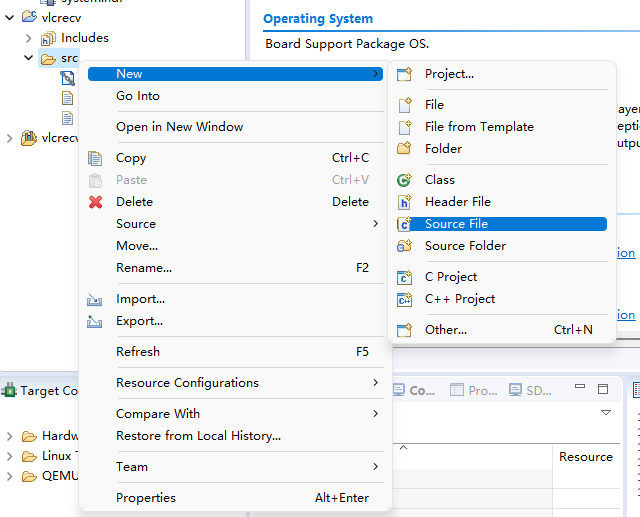

# Software for receiver 

- [Software for receiver](#software-for-receiver)
  - [Create a Application project](#create-a-application-project)
  - [Copy the Code to the Proejct](#copy-the-code-to-the-proejct)
  - [Change Macro defination](#change-macro-defination)
  - [Run Code](#run-code)

Once you export the **bitstream** and the **hardware**, we can launch the Xilinx SDK to develop the software for the system. 

Click `File` at the toolbar in Vivado, then click `Launch SDK`, next click `OK`. The SDK will launch and read the exported hardware. 

As we can see, all the custromed IP are shown at the HDF file as shown below 
```hdf
...
lcdctrl_lcdAxiAdapter_0     0x43c20000      0x43c2ffff
...
axi_fifo                    0x43c00000      0x43c0ffff
lcdctrl_axipwm_0            0x43c30000      0x43c3ffff
....
```

Note that the name may be different depending on the name of the subblock given during creation. 

## Create a Application project 

Click the `File` at the toolbar of the SDK, then click `NEW`->`Create Application Project`. A window shown below should popup. 


Give your project a name you like, then then click next. At the next page, we select `Empty Proejct`. Then click finish. 

## Copy the Code to the Proejct

you can create a source file or head file as shown below. Then copy and paste the code into the proejct. 

  

## Change Macro defination 
Once finished, we need to change some Macro definition. 

Firstly, open the `xparameter.h` file and the `axiiic.h`, change the following two macros from the `axiiic.h` to the correct version of the address defined in  `xparameter.h`. 

```c
// change the following two corresponding AXI IIC address
// modified the part start with XPAR
#define ADAUIICADDR XPAR_ADAU1761CTRL_AXI_IIC_0_BASEADDR
#define TOUCHIICADDR XPAR_LCDCTRL_AXI_IIC_0_BASEADDR
```

Then open `main.c`, change the follow macro to the correct address shown in `xparameter.h`
```c
// modified the part start with XPAR
#define ADAU1761SERIAL_BASEADDR XPAR_ADAU1761CTRL_SERIALWRAPPER_0_BASEADDR
```

## Run Code 

Once finished, press `Ctrl+S`. SDK will save and compile the code. 

Now, right click at the project folder -> `RUN AS` -> `RUN Configurations...`

Then click the lable named `Xilinx C/C++ application (System Debugger)`, then click `Reset entire system` and `Program FPGA` as shown below. 


Once done, connect your board to the computer and switch the bootmode of your boards to `JTAG` mode. Then power up your boards and click run. 
