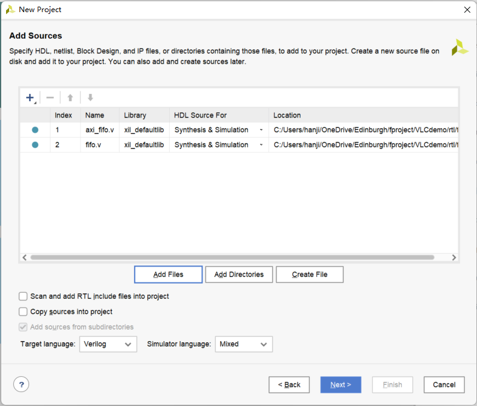
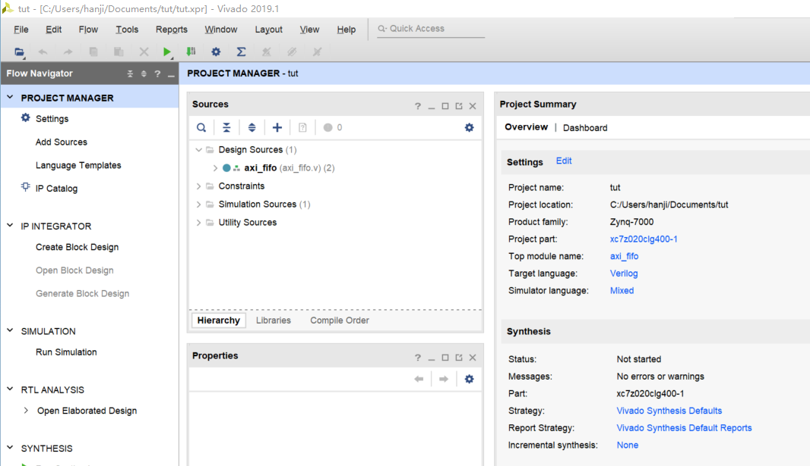
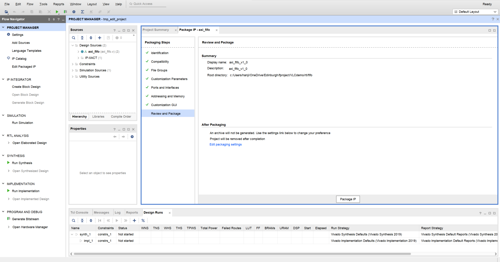
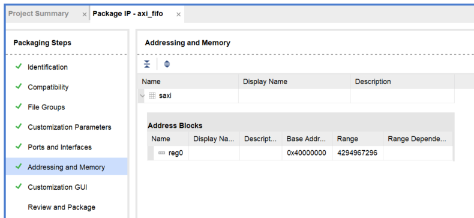
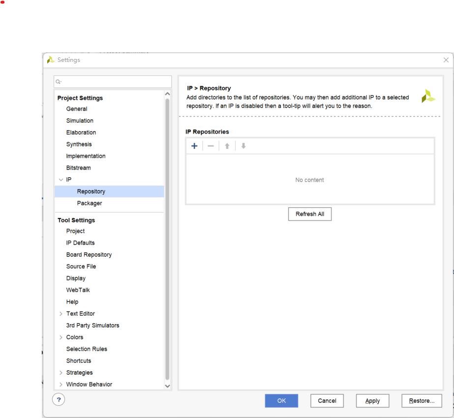
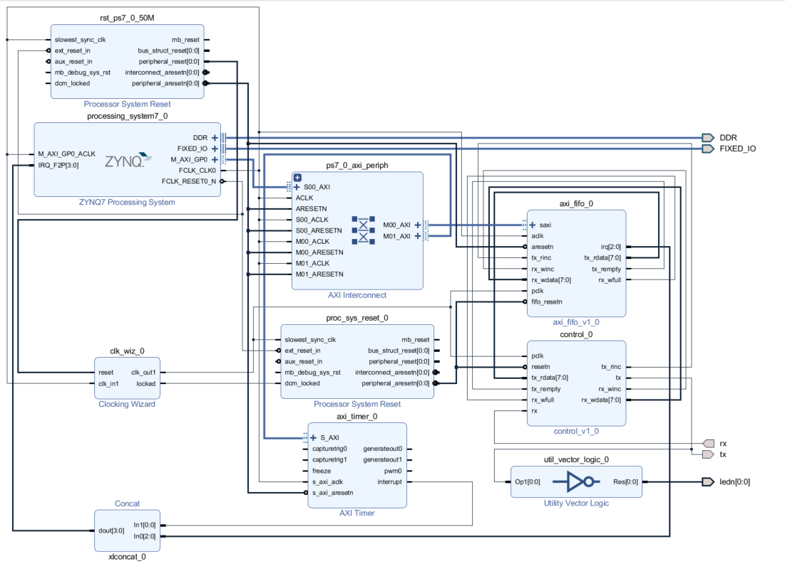

# Hardware for Transmitter 

- [Hardware for Transmitter](#hardware-for-transmitter)
  - [Generate Custom IPs](#generate-custom-ips)
    - [AXI FIFO](#axi-fifo)
    - [Control Module](#control-module)
  - [Create Block Diagram](#create-block-diagram)
    - [Create new project Add packaged IP to Vivado](#create-new-project-add-packaged-ip-to-vivado)
    - [Create Block Diagram](#create-block-diagram-1)
      - [ZYNQ7 Processing System](#zynq7-processing-system)
      - [Clocking Wizard](#clocking-wizard)
  - [Generate Bitstream](#generate-bitstream)
  - [Write Software in SDK](#write-software-in-sdk)

## Generate Custom IPs 
There are two modules that are written by myself, we need to use vivado to generate IPs first so that we can use them later in the block diagram. 

### AXI FIFO
Lets generate the FIFOs with AXI Lite interface first. This module act as a hardware buffer for the data from the ARM processing system and 

The first step is to create a new project from Vivado with the two source files: `./rtl/fifo/axi_fifo.v` and `./rtl/fifo/fifo.v` as shown in the figure below. 

 

We don't need and constraints at this state, so we skip the next step.  

Then, select the correct board, in our case, its `xc7z020clg400-1`. 

Once done, it should looks like this,

 

---
Next, in the tool bar, click `Tools` -> `Create and Package new IP...`  

A Welcome window will pop up, click next. 

At next window, select `Package your current project` and then click next. 

After that, choose one directory to store the packaged IP. Once selected, cleck next.  
*Please note that this directory will be add to the IP repository list later in Vivado. Therefore, choose a path that you can remember* 

And a summary will appera, click finish. 

Once done the above steps, a temp project looks like the following figure will pop up,   
  

---
Leave everything as default, except for `Addressing and memory`, change the Base Address of this module to `0x40000000` as shown below, 
  

Once done, click `Review and Packge` and then click `Package IP`

Congratulations, you have packaged your first IP. 

---
### Control Module 
The next IP is the control module for data transfer. 

The steps for for package this are exactly the same as mentioned above. The only **change** is to switch the source file. 

The source files involved are, 
```
./rtl/4b6b/control.v
./rtl/4b6b/fbsb.v
./rtl/4b6b/fbsbdecode.v
./rtl/4b6b/fbsbencoder.v
```

## Create Block Diagram 
Now you should have packaged two IPs, we need to connect them to gether with other IPs to make a hardware platform capable of modulate and demodulate the information. 

### Create new project Add packaged IP to Vivado 
Create a new project in vivado only selecting the correct board. 

Once the project is created, click `Seetings` located in the `Flow Navigator` at left side of the screen.  

Then, click `IP` -> `Repository`. Once finished, it should look like the figure below,  
  

Add the paths of the two IPs that we periviously packaged by clicking the `+` sign. 

Once finished, click OK to exit the setting. 

### Create Block Diagram
Now, we need to create the block diagram connecting out IPs with other IPs to form a complete platfrom.  

Still below the `Flow Navigotor`, click `Create Block Diagram`, then click OK. 

Now, we need to add extra IPs to our block diagram. The extra IPs needed is listing below, 

```
ZYNQ7 Processing System
Processor System Reset
AXI Interconnect
AXI Timer 
Clocking Wizard
Concat
Utility Vector Logic
```
Also we need the two IP we packaged.  

Some parameters need to be changed, please follow the tutorial below, **Plase note that all the pins (MIOs) are based on my board, if you are using a different board. See you schematics** 

#### ZYNQ7 Processing System  
Double click the IP block, a custom window will pop up. 

Click `MIO Configuration` at the `Page Navigator` at the left side of the window. 

Expand the tab `Memory Interface`, ticks the `Qual SPI Flash`

Expand the tab `I/O Peripheral`, ticks the `SD 0`, `UART 1`. And change the `BANK 1 I/O voltage` to `LVCMOS1.8V`. 

---
Click `Clock Configuration` at the `Page Navigator` at the left side of the window. 

Expand the tab `PL Fabric Clocks`, Changes the clock to `100MHz`

---
Click `DDR Configuration` at the `Page Navigator` at the left side of the window. 

Expand the tab `DDR Controller Configuration`, Changes the memort part to the right part number that matches your boards. 

---
Click `Interrupts` at the `Page Navigator` at the left side of the window. 

Tick and Expand the tab `Fabric Interrupts`, then expands the subtab `PL-PS Interrupts Prots`, tick the option `IRQ_F2P[15:0]`

#### Clocking Wizard
Double click the IP clock, and then clock the `Output Clocks` at top side of the window, tick and enable two output clock named, `clk_out1` and `clk_out2`. Change the `clk_out1` to `12.288MHz` and `clk_out2` to `16MHz`  

Once all custmizations are done, connect ALL IPs as shown in the figure below, *see expliaination below*


## Generate Bitstream 

## Write Software in SDK 

