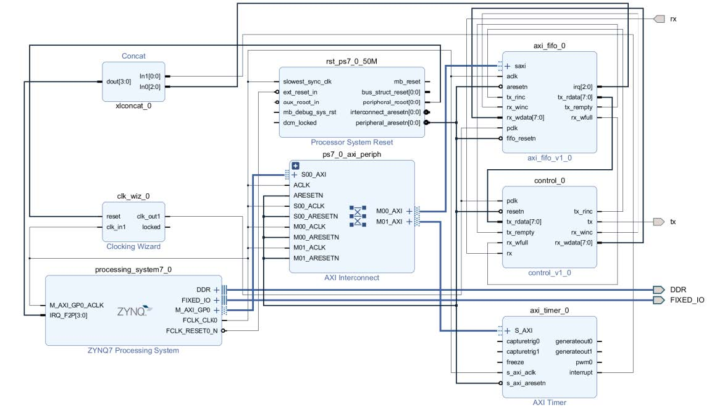

# Hardware for Transmitter 

The steps are similar to the tutorial in creating the receiver. The only changes to the transmitter is that less IPs are used. 

Only one `AXI Timer`, `axi_fifo_v1_0`, and `control_v1_0` are used. The only changes is in the create block diagram part, which is included in the tutorial. The other steps are similar to the receiver. 

The configuration for the `axi_fifo_v1_0` and the `control_v1_0` are the same as they are in the receiver. 

## AXI Timer 

Click `+`, then find the AXI Timer. Leave everything as default. 

The final connectiong of the system is shown below. 

  
